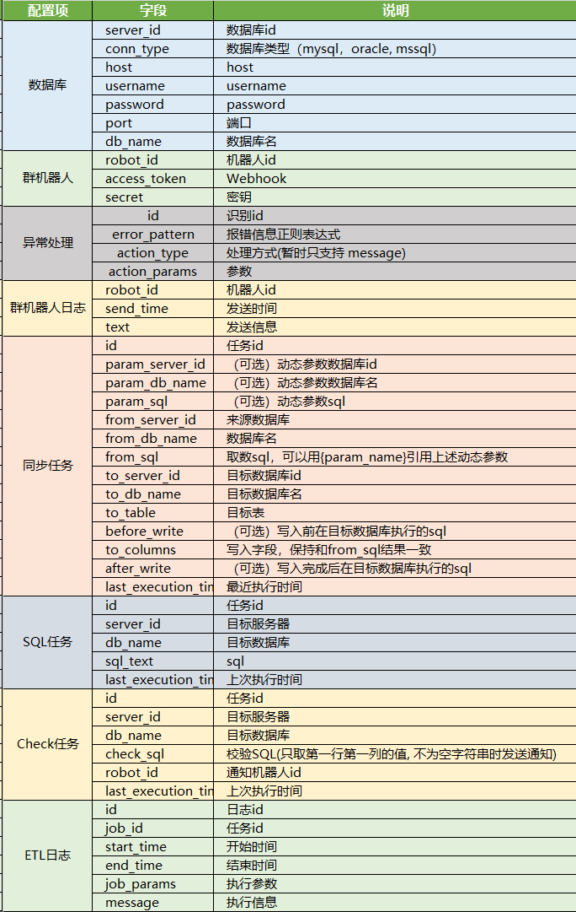
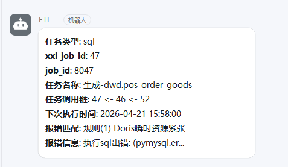
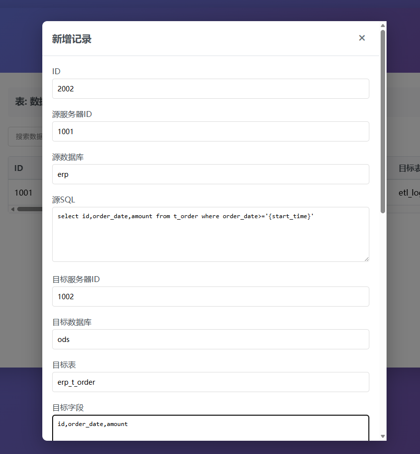

<div align="center">
  
</div>


[](https://github.com/996icu/996.ICU/blob/master/LICENSE)


## 吐槽
##### 搜索「如何搭建 ETL」
- X 云：一键部署 XXX 方案（需购买至少 3 台云主机, 绑定 5 个云产品）

##### 搜索「开源技术搭建 ETL」
- Hadoop 集群 + Kafka 集群 + Flink 集群 + Doris 集群 + DolphinScheduler

##### 关于CheapETL
- 主体仅依赖Python
- 大批量数据同步需要 DataX
- 消息通知需要 钉钉或企业微信

## 最小ETL单元
>有丰富的资源, 选择自己最顺手的工具就好
>
>这里用我自己开发的 [pyqueen](https://pyqueen.readthedocs.io/zh-cn/latest/) 包为例
>
>可以 `pip install pyqueen` 安装
### 公共配置 `settings.py`
```python
DATABASES = {
  '1001':{
    'conn_type': 'mysql',
    'host': 'localhost', 
    'username': 'reader', 
    'password': 'p123', 
    'port': '3306', 
    'db_name': 'oms'
  }
}
```
### Extraction
```python
from pyqueen import DataSource, TimeKit
from settings import DATABASES

tk = TimeKit() # 时间处理工具
start_time = tk.yesterday10 # 处理成 yyyy-mm-dd 长度10位格式

ds = DataSource(**DATABASES['1001']) # 数据源工具

sql = f'''
select * from t_order where created>='{start_time}'
'''
df = ds.read_sql(sql) # 读取为Pandas.DataFrame
```

### Transformation
- 基于 [Pandas](https://pandas.pydata.org/docs/) 能力
- 常用功能
```python
# 表关联, 合并
df = pd.merge(df, df_new, on='关联字段', how='left')
df = pd.concat([df, df_new], ignore_index=True)

# 分组求和, 计数, 去重, 极值, 分位数
df_result = df.groupby('用户ID').agg({
    'sales_amt': ['sum', 'count', 'max', 'mean', 'median', lambda x: x.quantile(0.75)],
    'goods_id': 'nunique'  # 去重计数
})
df.result.columns = ['总消费', '订单数', '最大金额', '平均金额', '中位数', '75分位数', '商品数']

# 分组取首末记录
df_sorted = df.sort_values('订单日期')
df_first_order = df_sorted.groupby('用户ID').head(1)
df_last_order = df_sorted.groupby('用户ID').tail(1)

# 分组拼接 (去重)
df_new = df.groupby('fd').agg({'value': lambda x: ','.join(x)}).reset_index()
df_new = df.groupby('fd').agg({'value': lambda x: '/'.join(str(xx) for xx in list(set(x)))}).reset_index()
```

### Loading
```python
# 执行SQL
d_sql = f'''
    delete 
    from ods_t_order 
    where create_time>='{start_date}' 
    and create_time<'{end_date1}'
'''
ds_dw.exe_sql(d_sql)

# 写入数据
ds_dw.to_db(df, 'ods_t_order')
```
### 总结
- 基于以上能力, 可以实现生成数据模型的核心逻辑. 如果数据需求规模不大, 完全足够
- 以零散脚本的形式管理etl逻辑, 数据流积累多了以后管理复杂
- 缺少日志记录, 无法追溯计算细节
- 缺少数据校验过程, 数据缺失无法及时知晓
- 缺少主动报错预警功能, 任务失败或者数据异常无法及时通知

## ETL框架
>用更优雅更通用的方式组织数据逻辑, 让不熟悉Python的人也可以用简单的配置或SQL生成数据流
>
### 基本概念



##### 公用资源
- 数据库
- 群机器人
- 日志

##### 通用的 ETL 任务
>其他直接编写python脚本的任务直接由调度工具管理即可

- 数据同步(sync, sync_datax)
- SQL任务(sql)
- 数据校验(check)

##### 一点建议
- 给每类资源按合适的规则编码
- 比如:
  - 数据库: 1001~1999
  - 同步任务: 2001~2999
  - SQL任务: 3001~3999
  - 校验任务: 4001~4999
  - 群机器人: 5001~5999

### 任务配置
##### 数据同步任务(基于Python) - sync
1. 从 同步任务 读取作业信息
1. 从 数据库 读取对应 param_server_id, from_server_id, to_server_id 的连接方式
1. (如有) 读取动态参数. 例如 param_sql 为
    ```sql 
   select max(update_time) as start_time from ods_order
    ```
    则解析运行参数
    ```python
    run_param = {'start_time':'2026-01-01 11:11:11'}
    ```
1. 生成最终取数sql, 例如 from_sql 为
    ```sql
    select a,b,c,d from erp_order where update_time>'{start_time}'
    ```
    则生成最终执行sql
    ```sql
    select a,b,c,d from erp_order where update_time>'2026-01-01 11:11:11'
    ```
1. 执行 before_write
1. 读取 最终执行sql 结果到 DataFrame
1. 写入目标数据
1. 执行 after_write
1. 记录日志

##### 数据同步任务(基于DataX) - sync_datax
1. 从`数据同步` 配置读取作业信息
1. 从 数据库 读取对应 param_server_id, from_server_id, to_server_id 的连接方式
1. (如有) 读取动态参数. 例如 param_sql 为
    ```sql
    select max(update_time) as start_time from ods_order
    ```
    则解析运行参数
    ```python
    run_param = {'start_time':'2026-01-01 11:11:11'}`
    ```
1. 生成最终取数sql, 例如 from_sql 为
    ```sql
    select a,b,c,d from erp_order where update_time>'{start_time}'
    ```
    则生成最终执行sql
    ```sql
    select a,b,c,d from erp_order where update_time>'2026-01-01 11:11:11'
    ```
1. 用上述参数生成 datax任务json 配置文件到临时目录
1. 生成 datax 命令行并执行任务
1. 解析输出结果, 获取同步行数. 或读取报错信息
1. 记录日志

##### SQL任务 - sql
1. 从`SQL任务` 配置读取作业信息
1. 从 数据库 读取对应 server_id 的连接方式
1. 读取SQL
1. 执行SQL

##### 数据校验任务 - check
1. 从`数据校验` 配置读取作业信息
1. 从 数据库 读取对应 server_id 的连接方式
1. 读取SQL
1. 执行SQL
1. 如果SQL结果不为空字符串"", 读取对应 robot_id 的配置
1. 发送执行结果字符串到对应的群机器人


## 安装配置 CheapETL

### 下载代码
```bash
git clone https://github.com/ts7ming/CheapETL
# 或 git clone https://gitee.com/ts7ming/CheapETL
```
### 准备环境
- 在MySQL执行 `CheapETL/docs/CheapETL.sql`

- 创建 `CheapETL/settings.py`
```python
DS_CONFIG = {
    'conn_type': 'mysql',
    'host': 'localhost',
    'username': 'root',
    'password': 'p123',
    'port': '3306',
    'db_name': 'dw'
}

# DS_CONFIG = {
#     'conn_type':'sqlite',
#     'host':'/CheapETL/matrix.db'
# }


# ----------------- 环境 -----------------
WORK_DIR = '/app/CheapETL'
DATAX_PY = '/opt/datax/bin/data.py'
PY_PATH = 'python3'

# ----------------- 配置表 -----------------
T_SERVER = 'etl_server'
T_JOB_LOG = 'etl_log'
T_CHECK = 'etl_job_check'
T_SYNC = 'etl_job_sync'
T_SQL = 'etl_job_sql'
T_ROBOTS = 'etl_robot'
T_MESSAGE = 'etl_robot_message'
T_ERR_HANDLING_CFG = 'etl_error_handling_config'


# ----------------- 数据库配置 -----------------
# 优先取此处配置, 配置了 ds_cfg 时用数据库配置补充
DATABASES = {
    '1001': {
        'conn_type': 'mysql',
        'host': 'localhost',
        'username': 'root',
        'password': 'p123',
        'port': '3306',
        'db_name': 'erp'
    },
}
# xxl_job 所在数据库, 可选, 用于任务报错时解析任务依赖和下次执行时间
XXL_JOB_DB_ID = None # '1001'

# ----------------- 群机器人配置 -----------------
# 优先取此处配置, 配置了 ds_cfg 时用数据库配置补充

# 用于发送报错通知
ADMIN_ROBOT = {
    'access_token': 'xxxxxx',
    'secret': 'xxxxxx'
}
# 其他预警和通知
ROBOTS = {
    '5001': {
        'access_token': 'xxxxxx',
        'secret': 'xxxxxx'
    }
}
```
### 添加配置
- 添加数据源
  - 在 etl_server 表添加数据源id和连接信息
  - 如果用datax写入 doris, 需要单独新建数据源id, port值为 fe_port,be_port 例如 9030,8030

- 配置同步任务
  - 在 MySQL etl_job_sync 表添加同步配置

- 执行同步任务
  - 通过 xxl-job, crontab 或其他方式执行
  ```bash
  python3 /CheapETL/main.py --job_type sync|sync_datax|sql|check --job_id JOB_ID [--xxl_job_id XXL_JOB_ID] [--key value]
  ```

通过命令行 --key value 指定参数, 优先级高于 etl_job_sync.param_sql
例如: 
```bash
python3 /CheapETL/main.py --job_type sync_datax --job_id 2002

python3 /CheapETL/main.py --job_type sync --job_id 2001 --start_date "$(date -d '-1 day' +%Y-%m-%d)" --end_date "$(date +%Y-%m-%d)"

python3 /CheapETL/main.py --job_type sql --job_id 3002

python3 /CheapETL/main.py --job_type check --job_id 4002
```
如果使用 xxl_job 工具, 可以传入 `--xxl_job_id XXL_JOB_ID` 任务报错时会自动根据xxl_job子任务配置追溯调用链路


### ETL开发
- 使用数据库管理工具(navicat/dbeaver/...)等直接编辑表即可
- 或者运行`start.bat`(测试中的功能)打开简易Web编辑

### 效果图





